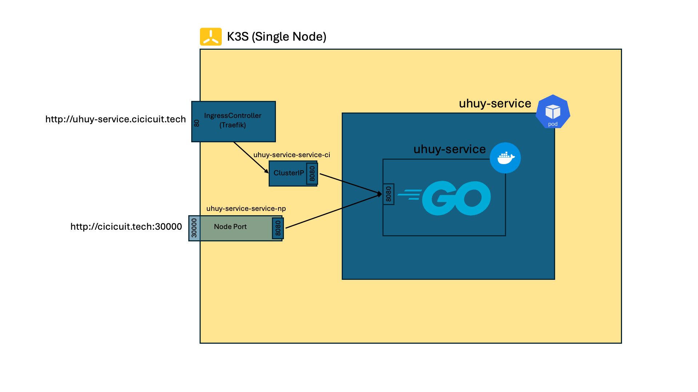

# Uhuy Service

## Public Endpoint

- Via IngressController: [http://uhuy-service.cicicuit.tech](http://uhuy-service.cicicuit.tech)
- Via NodePort: [http://uhuy-service.cicicuit.tech:30000](http://uhuy-service.cicicuit.tech:30000)

## Direct Dependencies/Packages/Modules

- [Echo](github.com/labstack/echo/v4) : Main web framework used to build RESTful APIs
- [Validator](github.com/go-playground/validator/v10) : Helps to validate parsed JSON payload

## Using the repo

Clone the repository

```bash
git clone https://github.com/yansetiaji/uhuy-service
cd uhuy-service
```

Run instantly at local development server:

```bash
go run server.go
```

Build as a binary and run:

```bash
go build -o server ./server.go
./server
```

Build docker image:

```bash
docker build -t uhuy-service:<tag> .
```


Run containerized version on localhost:

```bash
docker run -p 8080:8080 uhuy-service:<tag>
```

## Kubernetes (K3S) Deployment Visualized



## Step by Step to Kubernetes

### Create image repository at [Docker Hub Repository](https://hub.docker.com)


### Push builded local image to the [Docker Hub Repository](https://hub.docker.com)

Note: login required

```bash
docker push <username>/uhuy-service:<tag>
```


### Let's go to kubernetes

```bash
cd ./kubernetes
```

Create `uhuy` `namespace`. (Optional, you can use `default` `namespace` instead)

```bash
kubectl create -f Namespace.yaml
```


Change `contexts.context.namespace` in `KUBECONFIG`. (No need to do this if you're using `default` `namespace`)

```yaml
contexts:
- context:
    cluster: default
    user: default
    namespace: uhuy
  name: default
```

### Create Deployment

```bash
kubectl create -f Deployment.yaml
```


### Create Service

```bash
kubectl create -f Service-np.yaml
kubectl create -f Service-ci.yaml
```


### Create Ingress

```bash
kubectl create -f Ingress.yaml
```


Access via [Public link](#Public-Endpoint)


## Something may interest you

Since the format of `price` defined on the assignments looks like this

```json
{
    "name": "test-product",
    "description": "random-description",
    "price": 100.00
}
```

But on the frontend example is not using decimal places

I just follow the complex one, applied both for backend and frontend. And for the safety financial calculations record (in case further processing / calculations needed) the price data is saved with `int64` file type intead of `float64`

So I made a custom data type Decimal and different data model for API communications (price using `numerical`/`decimal`/`float64` with 2 digits precision) and (dummy) database purpose (price is using `int64`). [Check it here](https://github.com/yansetiaji/uhuy-service/blob/d57c744df458b48f01bcc9ca33956ec22ccaeb32/server.go#L15-L54)
